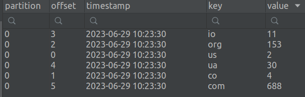

# Introduction into kafka streams

Here is [docker-compose.yml](https://github.com/Vadymor/data_streaming/blob/0c0492a9fdd75acbadc76f61a63bf30d7f6fbf3b/introduction_into_kafka_streams/docker-compose.yml)
for 3 brokers setup and producer service.

Message generator service is [here](https://github.com/Vadymor/data_streaming/blob/0c0492a9fdd75acbadc76f61a63bf30d7f6fbf3b/introduction_into_kafka_streams/message_generator).

This service is waiting for a csv file with a browser history.
The file should be in the correct format, for instance, [history.csv](https://github.com/Vadymor/data_streaming/blob/17721be64dcbf1fbb65c8516d1360609d60127fe/introduction_into_kafka_streams/message_generator/src/history.csv)

Streaming service is [here](https://github.com/Vadymor/data_streaming/blob/17721be64dcbf1fbb65c8516d1360609d60127fe/introduction_into_kafka_streams/scala_project).

To run this project you should:
1. Run docker compose.
2. Build and run streaming application.

Here is the output of the streaming application:

