# Investigation of kafka CLI tools

## Kafka 

Here is [docker-compose.yml](https://github.com/Vadymor/data_streaming/blob/995a38202f8077518f627ab408fa233d7a2e82ec/investigation_of_kafka_cli_tools/kafka/docker-compose.yml)
for 3 brokers setup.

The output of the ```docker ps```:

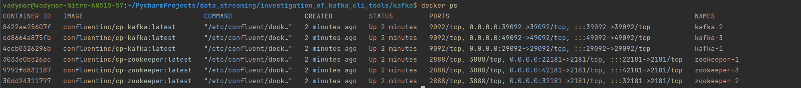

There are commands and their output:

1. Create a topic
```
docker exec kafka-1 \
kafka-topics --bootstrap-server kafka-1:9092 \
             --create \
             --topic first-topic
```

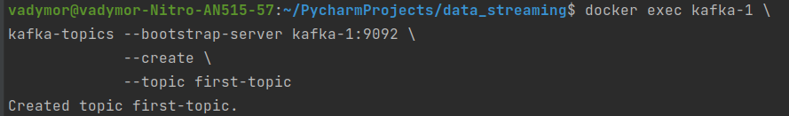

2. List topics
```
docker exec kafka-1 \
kafka-topics --list --bootstrap-server kafka-1:9092
```

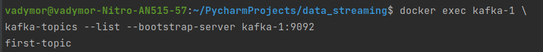

3. Sent at least 10 simple text messages with the console producer
```
docker exec --interactive --tty kafka-1 \
kafka-console-producer --bootstrap-server kafka-1:9092 \
                       --topic first-topic
```

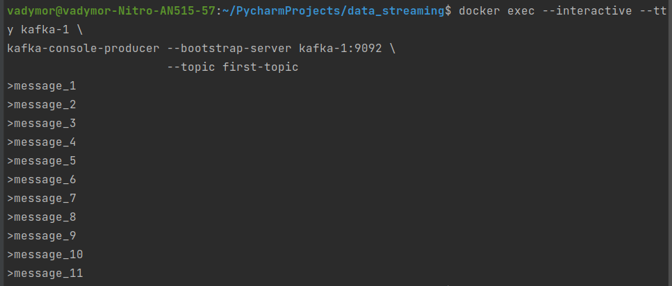

4. Receive the messages with the console  consumer
```
docker exec --interactive --tty kafka-1 \
kafka-console-consumer --bootstrap-server kafka-1:9092 \
                       --topic first-topic \
                       --from-beginning
```

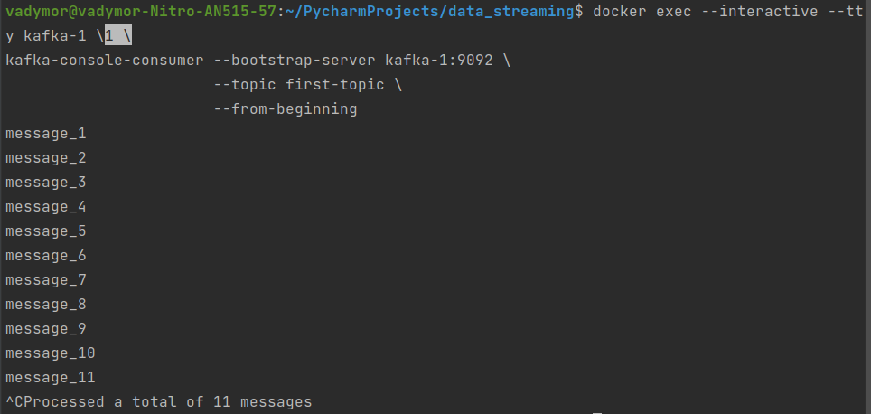

5. Delete the topic
```
docker exec kafka-1 \
kafka-topics --bootstrap-server kafka-1:9092 \
             --delete \
             --topic first-topic
```

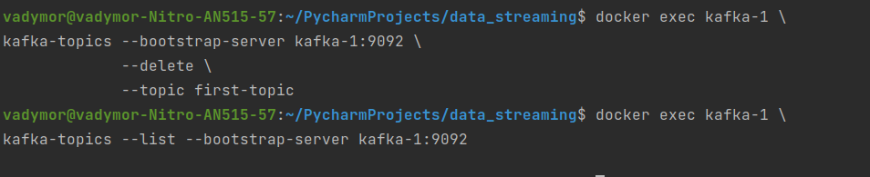


## Redpanda

Here is [docker-compose.yml](https://github.com/Vadymor/data_streaming/blob/904775b71eed504755d559242fd80f9cb09fb1d7/investigation_of_kafka_cli_tools/redpanda/docker-compose.yml)
for 3 brokers setup.

The output of the ```docker ps```:

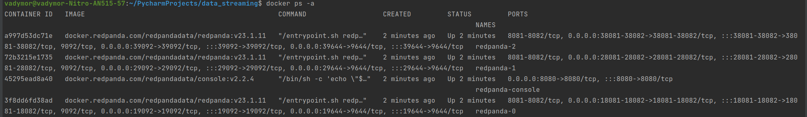

There are commands and their output:

1. Create a topic
```
docker exec -it redpanda-0 rpk topic create first-topic
```

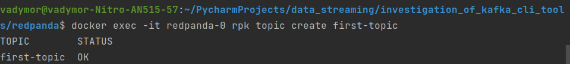

2. List topics
```
docker exec -it redpanda-0 rpk topic list
```

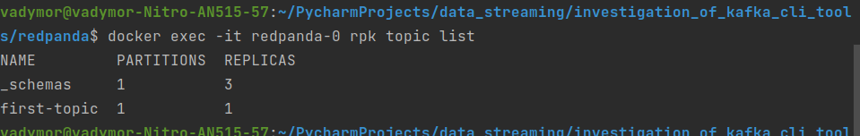

3. Sent at least 10 simple text messages with the console producer
```
docker exec -it redpanda-0 rpk topic produce first-topic
```

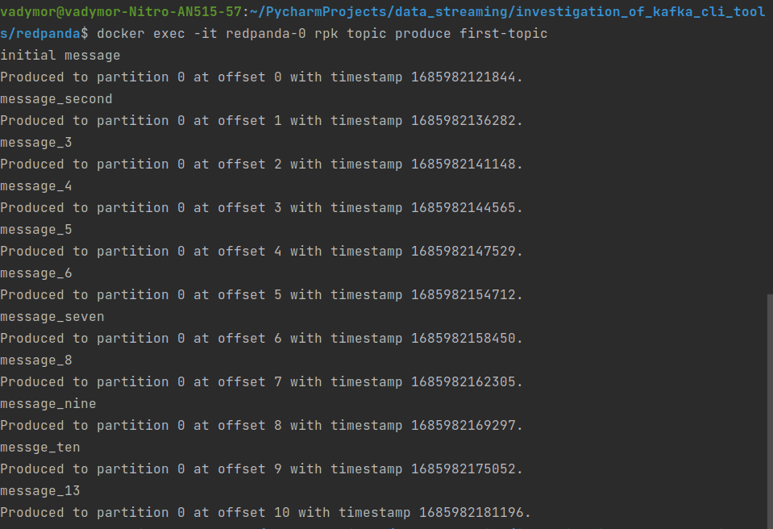

4. Receive the messages with the console  consumer
```
docker exec -it redpanda-0 rpk topic consume first-topic --offset=start
```

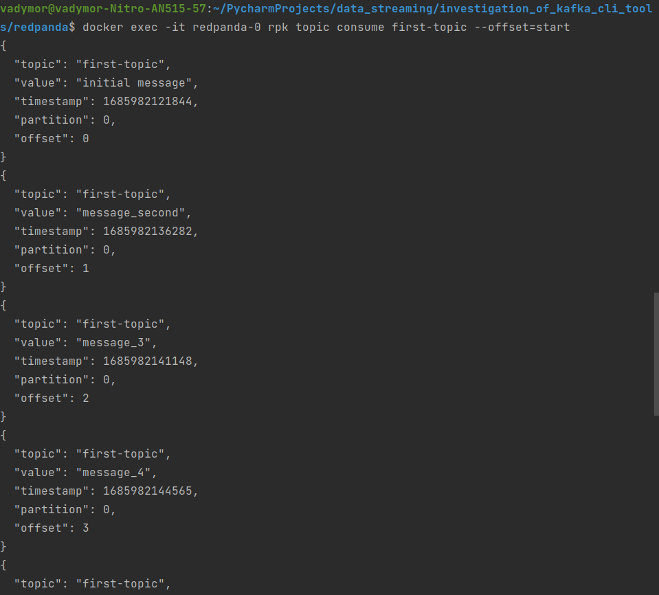

5. Delete the topic
```
docker exec -it redpanda-0 rpk topic delete first-topic
```

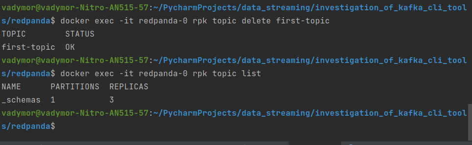


